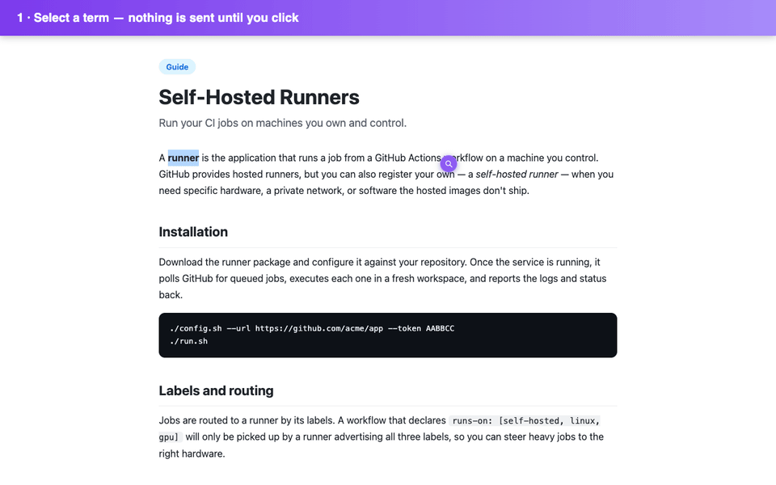
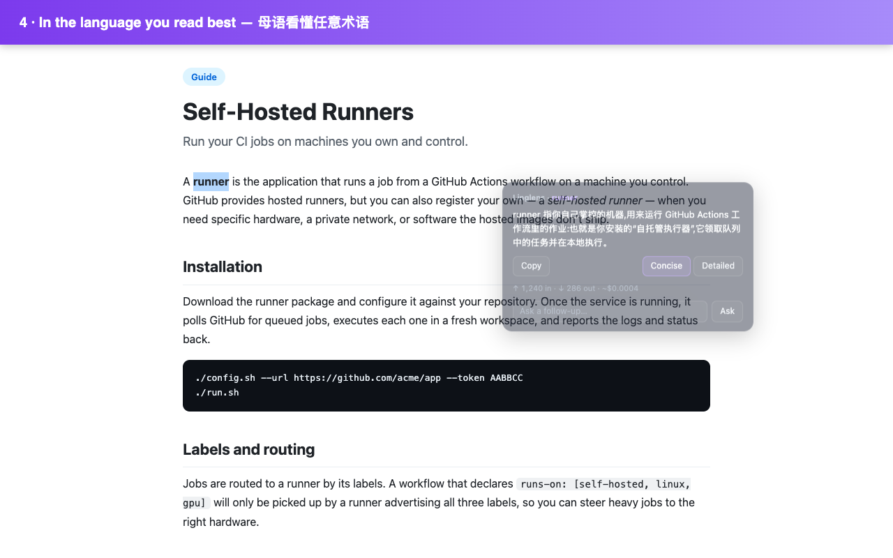

# Linglens

[](https://github.com/ZGhey/linglens/actions/workflows/ci.yml)
[](./LICENSE)
[](#contributing)

**Select a term on any web page and get it explained — in your language, grounded in the page you're reading, using your own API key.**



Linglens is a Chrome (Manifest V3) extension for reading technical documentation
in a language that isn't your first. You know the words; what you don't know is
what a term means _here_ — "runner" in a CI doc, "sink" in a streaming doc,
"hydration" in a frontend doc. Highlight it, click the icon, and Linglens
explains it in the context of that page, written in the language you read best.

**Open source · no servers · no telemetry.** Bring your own key: it's stored
locally and never leaves your browser except in the request _you_ trigger to the
provider _you_ choose. Nothing goes to us — there is no "us" backend.

## Why another explainer?

Full-page translators translate words but don't _explain_ a term's meaning in
context, and they mangle code. Most AI explainers are English-only and run on
someone else's key, someone else's cost, and someone else's server. Linglens is
different on three axes:

- **Your language.** Explanations come back in the language you configure
  (English, 中文, 日本語, and more) — not just English.
- **Your key, your control.** BYOK: OpenAI, Anthropic, Google Gemini, DeepSeek,
  or any OpenAI-compatible endpoint — including a **local model** that never
  leaves your machine. Real provider-reported token counts are shown per
  explanation, so you always know exactly what each answer used.
- **A conversation, not a one-shot.** Ask a follow-up right in the popup —
  "give an example", "how is this different from X?" — and keep the thread.



## Features

- Click-to-explain: a selection shows a small icon; **only clicking it calls the
  LLM**, so an accidental highlight never costs a token.
- Streaming answers rendered in a floating dark-glass popup that reads on any
  page (light or dark).
- Concise ↔ detailed length toggle; per-explanation token readout.
- Follow-up thread with running token-usage totals.
- Local, searchable history of the terms you've explained (no API call to
  re-read), with a configurable cap.
- Configure provider, model, key, language, and length from a toolbar popup.

## Install

### Chrome Web Store

Submitted — pending review. Until it's live, load from source below.

### From source

```bash
git clone https://github.com/ZGhey/linglens
cd linglens
npm install
npm run build        # outputs to dist/
```

Then in Chrome: open `chrome://extensions`, enable **Developer mode**, click
**Load unpacked**, and select the `dist/` folder. Pin the toolbar icon.

## Quick start

1. Click the pinned Linglens icon to open settings.
2. Pick a provider and paste your API key (or point the **Custom
   (OpenAI-compatible)** provider at a local model — no key needed for most
   local servers, enter any placeholder).
3. Choose your explanation language.
4. On any page, select a term → click the icon that appears.

Your key is stored locally and sent only to the provider you chose. See
[PRIVACY.md](./PRIVACY.md).

## Development

```bash
npm run dev          # Vite dev server with HMR
npm run typecheck    # tsc --noEmit
npm test             # unit tests (Vitest)
npx vitest run tests/providers/stream.test.ts   # a single test file
npm run test:e2e     # builds, then Playwright drives the loaded extension
```

Architecture notes for contributors live in [CLAUDE.md](./CLAUDE.md).

## Contributing

Issues and pull requests welcome. Dev setup is above; the architecture overview
lives in [CLAUDE.md](./CLAUDE.md). CI (typecheck + unit + e2e) runs on every PR.

## License

[MIT](./LICENSE).
